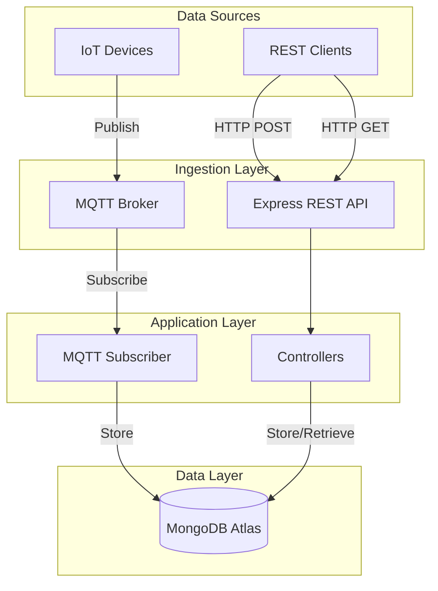
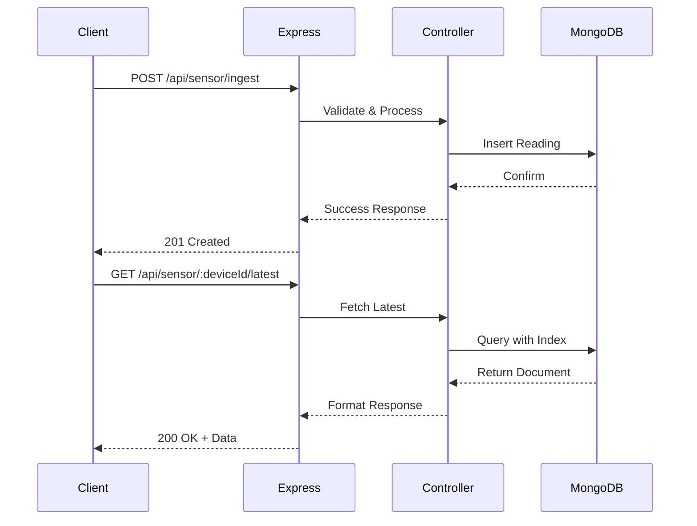
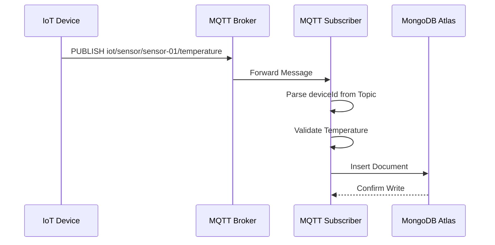
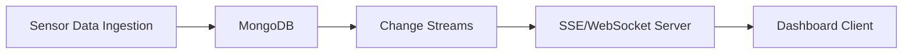

# IoT Sensor Backend – Node.js Internship Pre-Assessment

## Overview

This project is a Node.js backend service built as part of a pre-assessment assignment. It ingests IoT sensor temperature readings, stores them in MongoDB, and exposes APIs to retrieve the latest reading for a device. In addition to REST APIs, the system includes an MQTT subscriber to simulate real-world IoT data ingestion.

---

## Tech Stack

- **Node.js** (18+ / 20 LTS recommended)
- **Express.js** - REST API framework
- **MongoDB Atlas** (Free Tier) - Cloud database
- **Mongoose** - ODM for MongoDB
- **MQTT** - IoT message protocol (using public broker)
- **Postman / curl** - API testing

---

## System Architecture

### High-Level Architecture



### REST API Flow



### MQTT Ingestion Flow



---

## Project Structure

```
iot-sensor-backend/
│
├── src/
│   ├── config/
│   │   └── db.js                 # MongoDB connection
│   ├── controllers/
│   │   └── sensor.controller.js  # Business logic
│   ├── models/
│   │   └── SensorReading.js      # Mongoose schema
│   ├── routes/
│   │   └── sensor.routes.js      # API routes
│   ├── mqtt/
│   │   └── subscriber.js         # MQTT subscriber
│   └── app.js                    # Express app setup
│
├── server.js                     # Entry point
├── .env                          # Environment variables
├── .gitignore
├── package.json
└── README.md
```

---

## Database Schema

```javascript
{
  deviceId: String,        // Unique device identifier (indexed)
  temperature: Number,     // Temperature reading in Celsius
  timestamp: Number,       // Unix epoch milliseconds
  createdAt: Date         // MongoDB timestamp
}
```

**Indexes Applied:**
- Compound index on `(deviceId, timestamp)` for efficient latest reading queries
- Single index on `deviceId` for device-specific lookups

---

## API Endpoints

### 1. POST `/api/sensor/ingest`

Ingest a new temperature reading.

#### Request Body

```json
{
  "deviceId": "sensor-01",
  "temperature": 32.1,
  "timestamp": 1705312440000
}
```

- `deviceId` (required): Device identifier
- `temperature` (required): Temperature in Celsius
- `timestamp` (optional): Unix epoch milliseconds (defaults to current time)

#### curl Example

```bash
curl -X POST http://localhost:3000/api/sensor/ingest \
  -H "Content-Type: application/json" \
  -d '{
    "deviceId": "sensor-01",
    "temperature": 32.1
  }'
```

#### Postman Setup

1. Method: `POST`
2. URL: `http://localhost:3000/api/sensor/ingest`
3. Headers: `Content-Type: application/json`
4. Body → raw → JSON:
```json
{
  "deviceId": "sensor-01",
  "temperature": 32.1
}
```

#### Success Response

```json
{
  "message": "Reading ingested successfully",
  "data": {
    "_id": "679b016b3698b6d793f4a2d1",
    "deviceId": "sensor-01",
    "temperature": 32.1,
    "timestamp": 1706966897146,
    "createdAt": "2026-01-29T06:42:51.463Z"
  }
}
```

---

### 2. GET `/api/sensor/:deviceId/latest`

Retrieve the latest reading for a specific device.

#### URL Parameters

- `deviceId`: Device identifier

#### curl Example

```bash
curl http://localhost:3000/api/sensor/sensor-01/latest
```

#### Postman Setup

1. Method: `GET`
2. URL: `http://localhost:3000/api/sensor/sensor-01/latest`

#### Success Response

```json
{
  "_id": "679b016b3698b6d793f4a2d1",
  "deviceId": "sensor-01",
  "temperature": 32.1,
  "timestamp": 1706966897146,
  "createdAt": "2026-01-29T06:42:51.463Z"
}
```

#### Error Response (No Data)

```json
{
  "error": "No readings found for device: sensor-01"
}
```

---

## MQTT Integration

### Topic Structure

```
iot/sensor/+/temperature
```

- `+` is a wildcard matching any device ID
- Example: `iot/sensor/sensor-02/temperature`

### Publishing Test Data

Using Mosquitto CLI:

```bash
# Publish a temperature reading
mosquitto_pub -h test.mosquitto.org \
  -t iot/sensor/sensor-02/temperature \
  -m "29.4"
```

### Subscriber Logic

1. Connects to MQTT broker
2. Subscribes to `iot/sensor/+/temperature`
3. Extracts `deviceId` from topic path
4. Parses temperature from message payload
5. Stores in MongoDB with current timestamp

---

## Setup Instructions

### Prerequisites

- Node.js 18+ or 20 LTS
- MongoDB Atlas account (free tier)
- Git

### Installation Steps

1. **Clone the repository**
```bash
git clone <your-repo-url>
cd iot-sensor-backend
```

2. **Install dependencies**
```bash
npm install
```

3. **Configure environment variables**

Create a `.env` file in the root directory:

```env
PORT=3000
MONGO_URI=mongodb+srv://<username>:<password>@cluster0.xxxxx.mongodb.net/iot-sensor-db?retryWrites=true&w=majority
MQTT_BROKER_URL=mqtt://test.mosquitto.org
```

**Getting MongoDB URI:**
- Sign up at [MongoDB Atlas](https://www.mongodb.com/cloud/atlas)
- Create a free cluster
- Navigate to Database → Connect → Connect your application
- Copy the connection string and replace `<username>` and `<password>`

4. **Start the server**
```bash
node server.js
```

You should see:
```
Server running on port 3000
MongoDB Connected
MQTT Subscriber connected to mqtt://test.mosquitto.org
```

---

## Testing the Application

### Test REST API

```bash
# Ingest a reading
curl -X POST http://localhost:3000/api/sensor/ingest \
  -H "Content-Type: application/json" \
  -d '{"deviceId":"sensor-01","temperature":28.5}'

# Get latest reading
curl http://localhost:3000/api/sensor/sensor-01/latest
```

### Test MQTT Ingestion

```bash
# Publish via MQTT
mosquitto_pub -h test.mosquitto.org \
  -t iot/sensor/sensor-03/temperature \
  -m "31.2"

# Verify in database (use GET API)
curl http://localhost:3000/api/sensor/sensor-03/latest
```

---

## Design Considerations

### Scalability

- **Decoupled Ingestion**: REST and MQTT paths are independent
- **Indexed Queries**: Compound indexes on `(deviceId, timestamp)` optimize retrieval
- **Horizontal Scaling**: Stateless design allows multiple instances behind a load balancer

### Future Enhancements

1. **Message Queue Integration**: Use RabbitMQ/Kafka for buffering high-volume MQTT messages
2. **Batch Writes**: Group insertions to reduce database round trips
3. **Caching Layer**: Use Redis to cache latest readings per device
4. **Time-Series Optimization**: Implement TTL indexes for automatic data expiration
5. **Real-Time Updates**: Add Server-Sent Events (SSE) or WebSockets for dashboard push notifications

### Real-Time Dashboard Design

The current implementation uses REST polling, which meets assignment requirements. For production real-time dashboards:



This design is documented but not implemented to maintain assignment scope.

---

## Notes

- **MongoDB Atlas**: Free tier (M0) used with 512 MB storage
- **Node.js Version**: Tested on Node.js 20 LTS
- **MQTT Broker**: Public broker `test.mosquitto.org` used for demonstration
- **Security**: Production deployments should use authenticated MQTT brokers and encrypted connections

